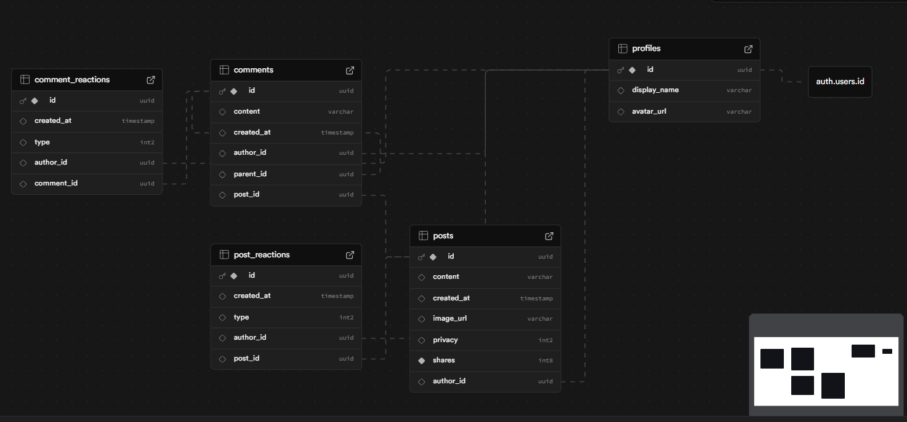

# BuddyScript API

A Kotlin-based Spring Boot API backed by Supabase Auth and Database
services.\
All endpoints require a **Bearer token** issued by Supabase. Users can
only access public data, plus private posts that they own.

------------------------------------------------------------------------

## 🚀 Features

### **Authentication**

-   Uses Supabase JWT.
-   Tokens are validated using
    `spring-boot-starter-oauth2-resource-server`.
-   Custom HMAC-SHA256 decoder configured with Supabase's JWT secret.

### **Posts**

-   Create posts
-   View public posts\
-   View your private posts\
-   Supports image URLs, privacy restrictions, share count

### **Comments**

-   Comment on posts\
-   Reply to comments (threaded replies)\
-   Fetch post comments and comment replies\
-   Reaction support for both comments and posts

### **Profiles**

-   Internal use for reference lookup\
-   Linked with Supabase's `auth.users` table

### **Reactions**

-   Post reactions\
-   Comment reactions\
-   Designed similarly to Facebook-style reaction system

------------------------------------------------------------------------

## 🧱 Tech Stack

### **Backend**

-   Spring Boot (Kotlin)
-   Spring Web
-   Spring Security & OAuth2 Resource Server
-   Spring Data JPA (Hibernate)
-   PostgreSQL (Supabase DB)

### **Tools & Libraries**

-   Jackson Kotlin Module\
-   JJWT for additional JWT handling\
-   `spring-dotenv` for `.env` loading\
-   Springdoc Swagger UI\
-   PostgreSQL JDBC driver

------------------------------------------------------------------------

## 📦 Dependencies

``` kotlin
dependencies {
    implementation("org.springframework.boot:spring-boot-starter-data-jpa")
    implementation("org.springframework.boot:spring-boot-starter-jdbc")
    implementation("org.springframework.boot:spring-boot-starter-security")
    implementation("org.springframework.boot:spring-boot-starter-web")
    implementation("com.fasterxml.jackson.module:jackson-module-kotlin")
    implementation("org.jetbrains.kotlin:kotlin-reflect")
    implementation("me.paulschwarz:spring-dotenv:4.0.0")
    implementation("io.jsonwebtoken:jjwt-api:0.13.0")
    implementation("io.jsonwebtoken:jjwt-impl:0.13.0")
    implementation("io.jsonwebtoken:jjwt-jackson:0.13.0")
    implementation("org.springdoc:springdoc-openapi-starter-webmvc-ui:2.8.8")
    implementation("org.springframework.boot:spring-boot-starter-oauth2-resource-server")
    implementation("org.springframework.boot:spring-boot-starter-oauth2-client")
    runtimeOnly("org.postgresql:postgresql")
    testImplementation("org.springframework.boot:spring-boot-starter-data-jpa-test")
    testImplementation("org.springframework.boot:spring-boot-starter-jdbc-test")
    testImplementation("org.springframework.boot:spring-boot-starter-security-test")
    testImplementation("org.springframework.boot:spring-boot-starter-webmvc-test")
    testImplementation("org.jetbrains.kotlin:kotlin-test-junit5")
    testRuntimeOnly("org.junit.platform:junit-platform-launcher")
}
```

------------------------------------------------------------------------

## ⚙️ Configuration

Create `application-dev.properties`:

``` properties
# Swagger
springdoc.api-docs.enabled=true
springdoc.api-docs.version=OPENAPI_3_1
springdoc.swagger-ui.enabled=true
springdoc.swagger-ui.path=/docs

# Security Config
supabase.jwt.secret=<your-secret>
spring.security.oauth2.resourceserver.jwt.jws-algorithm=HS256

# PostgreSQL connection settings
spring.datasource.url=<your-url>
spring.datasource.username=<your-username>
spring.datasource.password=<your-password>
spring.datasource.driver-class-name=org.postgresql.Driver

# Hibernate settings
spring.jpa.hibernate.ddl-auto=update
spring.jpa.show-sql=true
spring.jpa.properties.hibernate.dialect=org.hibernate.dialect.PostgreSQLDialect
```

------------------------------------------------------------------------

## 📁 Project Structure

    com.mmxniloy.buddyscript
    │
    ├── config/
    │   ├── props/
    │   │   └── SupabaseJwtProps.kt       # Loads Supabase secret
    │   ├── JwtConfig.kt                  # HMAC SHA256 JwtDecoder bean
    │   ├── OpenApiConfig.kt
    │   └── SecurityConfig.kt             # No CSRF, JWT auth, Swagger whitelist
    │
    ├── features/
    │   ├── comments/
    │   │   ├── dto/
    │   │   ├── CommentController.kt
    │   │   ├── CommentEntity.kt
    │   │   ├── CommentRepository.kt
    │   │   └── CommentService.kt
    │   │
    │   ├── post/
    │   │   ├── dto/
    │   │   ├── PostController.kt
    │   │   ├── PostEntity.kt
    │   │   ├── PostRepository.kt
    │   │   └── PostService.kt
    │   │
    │   ├── profile/
    │   │   └── ProfileService.kt
    │   │
    │   └── reaction/
    │       ├── comment/
    │       └── post/
    │       # Both mirror the comment/post folder structure
    │
    └── Application.kt

------------------------------------------------------------------------

## 🗄️ Database ERD


------------------------------------------------------------------------

## 🏁 Running the Project

### **Step 1 --- Add `.env`**

    SUPABASE_JWT_SECRET=...
    DATABASE_URL=...

### **Step 2 --- Run Spring Boot**

``` bash
./gradlew bootRun --args='--spring.profiles.active=dev'
```

### **Step 3 --- Open Swagger Docs**

    http://localhost:8080/docs

------------------------------------------------------------------------

## 📜 License

MIT -- free for personal and commercial use.

------------------------------------------------------------------------